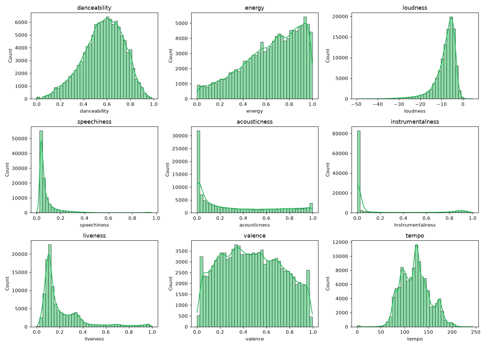

# Inteligência Analítica e EDA

O motor do PulseFlow baseia-se no cruzamento de dados biométricos/contextuais com a taxonomia musical. A análise foi feita sobre o **Spotify Tracks Dataset**.

### 1. Higienização e Perfil da Base
A base inicial de 114.000 registros passou por deduplicação de catálogo, resultando em **89.741 faixas únicas**. Identificamos viés de popularidade e anomalias acústicas (ex: faixas rotuladas como `sleep` apresentando picos de volume de até -7.9 dB).

### 2. Feature Engineering (As Fórmulas do PulseFlow)
Para superar a ausência de rótulos de contexto, criamos índices determinísticos (*Hard Filters*) aplicados na sanitização:
* **CDI (Cognitive Distraction Index):** `Speechiness * (1 - Instrumentalness) * Loudness_norm`. Mede o risco de quebra de foco por vocais audíveis e alta pressão sonora.
* **ACS (Acoustic Calm Score):** `Acousticness * (1 - Energy) * (1 - Danceability)`. Valida a blindagem contra ruídos em estados de desaceleração.
* **DIS (Dynamic Intensity Score):** Otimizado para Treino.

### 3. Principais Descobertas e Evidências

* **O Paradoxo Foco vs. Sono:** O submodo de Programação atinge foco extremo combinando *alta energia (0.659)* com *alta instrumentalidade (0.832)*, provando que o fluxo não requer música lenta, mas sim baixo CDI (0.007).
* **Densidade de BPM no Treino:** O modo Treino apresentou densidade de pico concentrada na faixa de **125 a 135 BPM**, casando perfeitamente com a cadência aeróbica padrão e FC em Zona 3, viabilizando o uso futuro do Smartwatch como controlador de transição.
* **Fronteiras Seguras de Sono:** A aplicação da mediana do Score ACS extinguiu o risco de falsos positivos entre Sono e Treino, corrigindo as falhas humanas de categorização do Spotify.

*O código completo de limpeza, processamento e modelagem pode ser encontrado no repositório em `src/notebooks/PulseFlow_Notebook_Corrigido.ipynb`.*